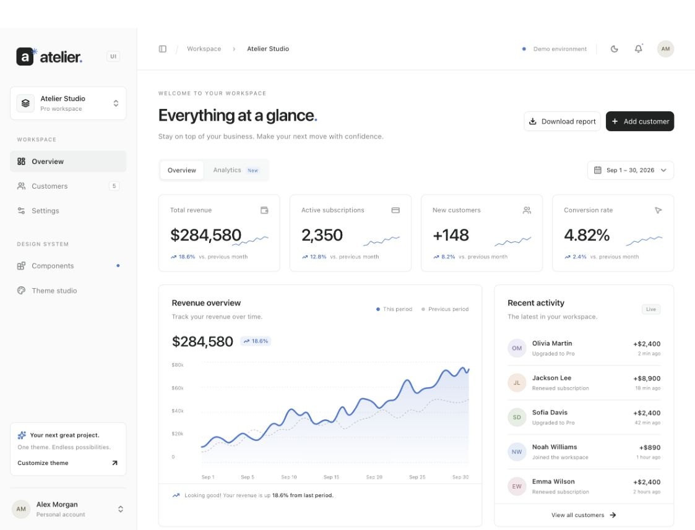

# Atelier UI

**A clean starting point for your next Angular project.**

An open-source dashboard starter built with **Angular 22**, **Analog 2.7**, and **Taiga UI 5**. Neutral surfaces, subtle borders, compact controls, and a reusable theme inspired by the visual language of shadcn/ui and Radix.

Atelier uses real Taiga UI controls. It is not a React port or an official shadcn, Radix, or Taiga UI theme.



## What's inside

- Dashboard with metric cards, a revenue chart, period selection, and CSV export.
- Customer search, filtering, sorting, selection, and a validated creation dialog.
- Component gallery: buttons, text fields, checkboxes, radios, switches, sliders, and dialogs.
- Theme studio with light/dark modes, four accents, adjustable corners, and JSON export.
- Responsive navigation and local profile preferences.
- A separate **`atelier-theme`** package with CSS, LESS, typed configuration helpers, and no runtime dependencies.

## Quick start

Use Node.js **24 LTS** and pnpm **11.25.0**. Node 22.22.3 or newer is also supported by the starter's engine requirement.

```sh
pnpm install
pnpm dev
```

Open http://127.0.0.1:5173. Theme assets are built automatically before the demo starts.

| Command             | Purpose                                                                  |
| ------------------- | ------------------------------------------------------------------------ |
| `pnpm dev`          | Start the demo                                                           |
| `pnpm build`        | Build the theme and production app                                       |
| `pnpm preview`      | Serve the production build                                               |
| `pnpm test:ci`      | Run Angular and theme package tests                                      |
| `pnpm format:check` | Check source formatting                                                  |
| `pnpm pack:theme`   | Build a local npm-compatible theme tarball in `artifacts/`               |
| `pnpm test:package` | Install the packed theme into an isolated consumer and check its exports |

## Pages

| Route         | Example                              |
| ------------- | ------------------------------------ |
| `/`           | Dashboard overview                   |
| `/customers`  | Customer management                  |
| `/components` | Interactive component gallery        |
| `/theme`      | Theme studio                         |
| `/settings`   | Profile and notification preferences |

## Use the theme in another project

The theme package is prepared for npm, **but is not published yet**. `atelier-theme` is a provisional local package name; registry ownership has not been established.

```sh
# In this repository
pnpm pack:theme

# In your Angular application; substitute the actual path to the tarball
pnpm add /path/to/atelier-theme-0.1.0.tgz
```

Load Taiga UI's base styles first, then Atelier:

```less
@import "@taiga-ui/styles/taiga-ui-theme.less";
@import (inline) "atelier-theme/theme.css";
```

Configure `provideTaiga()` and wrap your application in `<tui-root>`. The theme package does not install or configure Taiga UI, icons, or fonts for you. See the [package README](packages/theme/README.md) for full integration details and the configuration API.

The demo consumes this same package through a pnpm workspace dependency; there is no separate, drifting copy of the theme.

## Project layout

```text
packages/theme/       Publishable theme source and package documentation
src/app/pages/        Analog file-based routes
src/app/ui/           Demo components, state, and Angular theme adapter
src/styles.less       Demo layout and custom HTML component styles
scripts/              Theme build and packed-consumer checks
.github/              CI, issue templates, and pull request template
```

The package owns semantic colors, typography, corners, and Taiga overrides. The dashboard shell, tables, avatars, badges, and chart layout remain in the demo. This is a theme package and starter, not a complete independent component library.

## Demo boundaries

All records and financial metrics are fictional. Customer data lives in memory and resets on refresh. Theme and profile preferences are stored only in the browser. No authentication, database, email delivery, billing, or production API is implemented.

Analog runs in **SPA mode** (`ssr: false`). SSR is not part of the validated configuration. The chart is an illustrative SVG, not a data visualization library. The theme currently targets Taiga UI **5.25.x** and is validated in this Angular 22 demo; other versions require testing.

## Contributing and releases

Small, focused improvements are welcome. Read [CONTRIBUTING.md](CONTRIBUTING.md), the [roadmap](docs/ROADMAP.md), and the [release guide](docs/RELEASING.md). Upcoming work and published changes are tracked in [CHANGELOG.md](CHANGELOG.md).

## License and credits

Original Atelier code is available under the [MIT license](LICENSE). Dependencies, icons, and fonts retain their own licenses; see [third-party notices](THIRD_PARTY_NOTICES.md).

Built on [Angular](https://angular.dev), [Analog](https://analogjs.org), and [Taiga UI](https://taiga-ui.dev). The demo uses locally served Inter fonts and icons distributed by Taiga UI.
